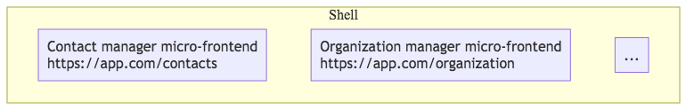
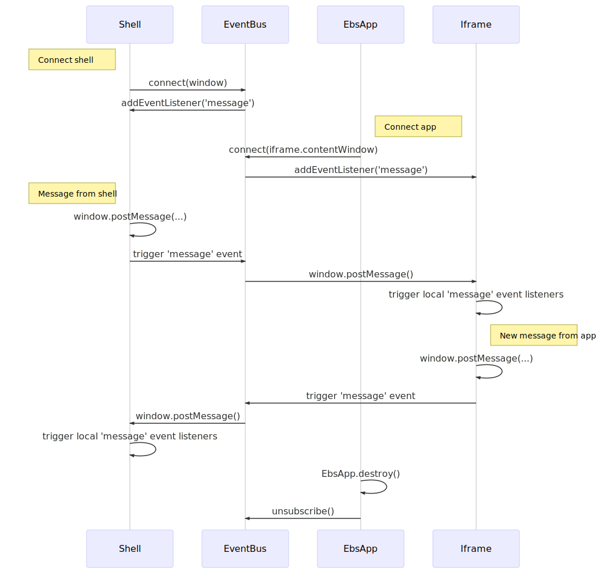
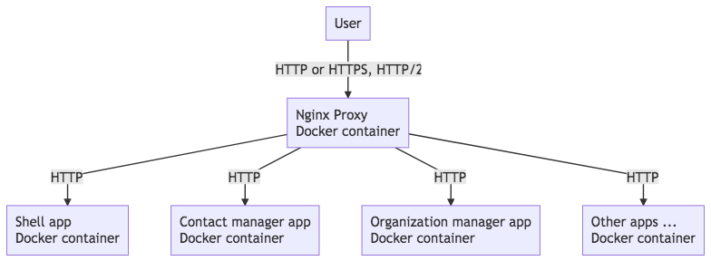

# micro-frontend concept

A PoC implementation of the micro-frontend pattern. The main goals of the concept are:
- Ease of maintenance
- Stability
- Extensibility
- Freedom to choose different tech stacks

## Concept

- The main part of each screen is separated in its own micro-frontend
- Micro-frontends are rendered inside a "shell" application.
- Each micro-frontend is hosted as a separate application to allow for an independent life cycle.

## Building block view

The solution consists of the following major components:
- The "shell" application is implemented using Vue.js CLI
- Several micro-frontends: contact manager, organization manager, pod manager, building manager, TAM and settings.
- A reverse proxy to serve the shell and micro-frontends.



### Shell Component

The shell app is generated using [Vue CLI](https://cli.vuejs.org/) to avoid maintaining a custom project setup.

The shell app uses the [EbsApp](../src/ebs-shell/src/micro-frontends/EbsApp.vue) component Vue.js component to render each micro-frontend and the [EventBus](../src/ebs-shell/src/micro-frontends/EventBus.js) to enable communication between micro-frontends.



Currently, all the microfronts are rendered as normal components under the Shell app, who is going to be aware of which microfrontends need to be rendered. [See the folder](https://github.com/jelisejev/microfrontend_concept/tree/master/src/ebs-shell/src/components/apps).

Every time you add a new component to the architecture, you'll need to add it to the shell component.

Taking the Settings microfrontend component as an example, [this is the implementation from the perspective of the shell](https://github.com/jelisejev/microfrontend_concept/blob/master/src/ebs-shell/src/components/apps/SettingsApp.vue).

```vue
<template>
  <ebs-app src="/settings-app"></ebs-app>
</template>
```

As you can see, there's a custom element called `ebs-app` which is an iframe element.
This iframe will be rendered dynamically, and the URL or `src` will determine the path of the microfrontend that should be rendered inside of it.

Using iframes comes with extra efforts, and one of them is the fact of responsiveness. For that purpose, a library called `iframeResizer` is used under the hood to load properly the iframe contents. [Here is the implementation of the iframe custom element](https://github.com/jelisejev/microfrontend_concept/blob/master/src/ebs-shell/src/micro-frontends/EbsApp.vue).

### Micro-frontends

Each micro-frontend is based on [Nuxt.js](https://nuxtjs.org/guide) as the most popular out of the box implementation of server-side rendering for Vue.js. The decision of using this tool was taking because of the fact that we prefer vuejs for our applications, but there's the flexibility and possibility of using any Server Side rendering framework or even your own custom server side rendering solution.

Using libraries like React is allowed and any potential framework that can appear in the future can be adapted too.
It only has to respect the communication protocols and the iframe rendering. We isolate every component with the iframes. Actually, the Shell microfrontend does not care about the implementation of each Iframe.

## Runtime view

### Rendering micro-frontends

Micro-frontends are rendered by embedding remote applications using iframes. This allows to:
1. Easily embed remote applications in the shell.
2. Encapsulate its HTML and CSS.
3. Completely isolate its JavaScript runtime.

From the downsides of this approach one can note that some additional efforts might be required to make the iframe
fit nicely in the overall layout of the application, and there's a small delay the first time that the app is loaded. Nonetheless, caching solutions must be used in order to improve the loading performance and user experience.

The logic of working with iframes is encapsulated in the [EbsApp](../src/ebs-shell/src/micro-frontends/EbsApp.vue) app component.

### Communication between Microfront components

The micro-frontends need to be able to communicate with other micro-frontends and the shell itself. To enable easier
integration of new micro-frontends, the communication is done using an event-based API.

Since iframes are used to render the microfrontends, there is a native communication method named [window.postMessage()](https://developer.mozilla.org/en-US/docs/Web/API/Window/postMessage) that allows to
communicate between different `window` objects. Consumers can subscribe to messages by listening to the `message` event.

Since we have a Master/Shell component that is responsible for rendering another components, the communication is allowed in both ways: From parent to the children and from children to the parent.

These are native specifications implemented by all the browsers, so having this communication method is more secure compared to the others that are library-based.

The methods are:

1. **window.parent.postMessage()**: Message from child to parent
2. **iframe.contentWindow.postMessage()**: Message from parent to child

The relationship between the elements is unidrectional: The parent can have access to the content of the child, but not on the contrary direction.

Messaging between different `window` objects is seamlessly integrated together using a simple [event bus](../src/ebs-shell/src/micro-frontends/EventBus.js) that listens to messages on each of the windows
and broadcasts them to others. This way the applications won't even know that they are talking to a different application.

### Communication between Components and Server

Communicating between micro-frontend and server side is also allowed and will be needed, since of course the data is going to be retrieved from the server.

The way of doing that will depend on the tool that you're using, but this can be achieved using the well known HTTP/HTTPS protocol.

In vuejs, you have to declare some actions that will be dispatched from the View components, and these actions will trigger a side-effect, in this case is a server call.

Libraries like Vuejs need the usage of Vuex, since Vue only takes care of the renderization. Vuex comes into play to deal with the model of the application, and uses the Reactive pattern explained [here](https://vuejs.org/v2/guide/reactivity.html) in detail.

Vuex needs three actors in order to be able to fetch data from the server:

1. State
2. Mutations
3. Actions

The whole story comes into play in the following order:

1. An initial state is created. This state will be responsible to store the current state/data of you application.
2. Actions are created in order to represent how the state can be changed. Actions are dispatched/triggered from the components, but the actions won't modify the state, they're just like an API definition of how the state can be mutated.
3. Mutations are functions that are the only ones allowed to mutate the state. They are called when actions are triggered.

In general terms, Redux(Model library for React) works in the same way and respect the same flow principles.

### Performance Caveats

As mentioned before, loading iframes comes with an extra overhead that wouldn't exist if you used WebComponents for instance, even though it's a tradeoff that we think can be afforded.
Performance will be affected of course, and caching methods should be used under the nginx proxy and the server side renderer in order to improve this loading fact.
You can use a loading spinner while the content is loaded or something, but it has to be treated somehow.

Internally inside every microfrontend, all the scripts will be scoped to the iframe and should be loaded asynchronously. That was one of the reasons to avoid the WebComponent approach, since all the scripts would need to be loaded globally and under the same scope, leading to potential integrations problems whenever two microfrontends could use the same namespace or a global object.

Using iframes this is completely isolated, so the javascript scripts can be loaded separately. This avoids also problems with libraries compatibility, it needs to be assumed that every component is isolated and MUST be able to exist in a separated environment. The dependency between components should be avoided with maximum effort since we want a plug and play architecture in which if I dettach a component, the rest of the system needs to be remain working.

#### Message envelope

Messages are represented using objects with a `type` property and any other payload.

```js
{
    type: 'app.my-message',
    customProperty: 'some-value'
}
```

The `type` property needs to start with `app.` to distinguish application messages from the rest.

#### Messaging sequence diagram



## Deployment view

Each micro-frontend the shell app is deployed as a separate Docker container. All of them are served via a single reverse Nginx proxy.
The proxy is used to avoid limitations with loading resources from different domains. It can also be used for SSL and HTTP/2 termination.



## Development

### Development mode

1. Run a micro-service that you need, e.g. contacts:

```bash
cd ebs-contacts
npm i
npm run dev
```

1. Run the shell app:

```bash
cd ebs-shell
npm i
npm run serve
```

### Running in Docker

To start the application using Docker run `docker-compose up` and open [localhost:3000](http://localhost:3000) in your browser.

### Adding new micro-frontends

To add a new micro-frontend using Nuxt.js follow these steps:
1. Generate a new project. Choose SSR and use npm as the package manager.
```
npx create-nuxt-app <project-name>
```
2. Configure the base URL for the app to properly serve assets by adding the following code to the `nuxt.config.js` file:
```js
  router: {
    base: '/<app-url>/'
  }
```
3. Choose and configure a unique port for the app.
4. You should now be able to run the app using `npm run dev` and open it on
`http://localhost:<port>/<app-url>/`
5. Create a proxy in the `ebs-shell` `vue.config.js` to serve the app in development mode. Verify that its working by running the shell and opening `/<app-url/`.
6. Render the micro-frontend in the shell-app using the `EbsApp` component.

Every micro-frondend should contain the following basic structure. Additional folders and files will depend on the library or framework that you'll use, but you should stick at least to the following structure.

```
.
├── Dockerfile
├── README.md
├── assets
│   ├── README.md
│   ├── css
│   ├── fonts
│   └── img
│   └── js
├── components
│   ├── Component.vue
│   └── README.md
├── package.json
├── server
│   └── index.js
├── static
│   ├── README.md
│   └── favicon.ico
├── store
│   └── README.md
```

#### Production setup
1. Add a `Dockerfile` to the new project.
1. Configure the app in the `ebs-proxy`.
1. Add the new app to `docker-compose.yml`.

# Notes

### Web Components

Using web components to embed server-side rendered applications has a number of issues:
- JS contained in the embedded app needs to be executed manually. When loading the app using ajax and including it
in the shell, the browser does not evaluate the included `script` tags. They need to be evaluated manually. While this is
doable for synchronous scripts, it can be tricky to get the execution order correctly when the app uses `async` and `defer`
for loading scripts.
- JS will be executed in the global context. Web components do not provide any mechanism for sandboxing the JS code of the
embedded app. Since the rest of the HTML code is encapsulated in a shadow root, the globally evaluated scripts will fail to
access some of the DOM elements. For example, nuxt.js crashes with an error when trying to locate the `#__nuxt` element.
- Since JS is executed in the global scope, running multiple applications will cause them to interfere with each other. For example,
nuxt.js relies on the `window.__NUXT__` variable to propagate data from the server-side to the client. Loading libraries of
different versions for different apps is also likely to cause problems.

Considering these factors, web components don't seem like a proper way to embed server-side rendered applications.

References on using web components:
- https://developer.mozilla.org/en-US/docs/Web/Web_Components
- https://www.sitepen.com/blog/2018/07/06/web-components-in-2018/
- https://custom-elements-everywhere.com/

## References

Useful articles on the micro-frontend pattern:
- https://medium.embengineering.com/micro-front-ends-whats-the-best-solution-3bc31218eae4
- https://medium.com/@_rchaves_/building-microfrontends-part-i-creating-small-apps-710d709b48b7
